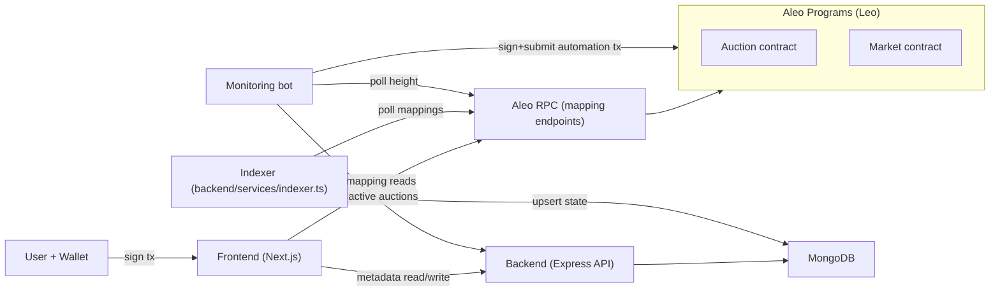
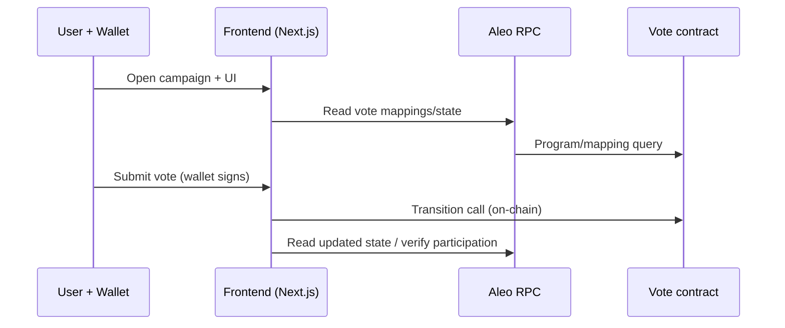

# :triangular_ruler: Architecture (Veil Protocol / voteAleo)

This repo is a mono-repo with:
- :ballot_box_with_ballot: a **Voting** system (on-chain Leo contract + frontend UI)
- :lock: a **Privacy-preserving Auction** system (on-chain Leo contract + UI + dispute/cancel/prove)
- :shopping_cart: a **Marketplace** (on-chain Leo contract + UI pages)
- :brain: an **off-chain backend** for metadata + indexing (MongoDB)
- :robot: an **automation/monitoring bot**
- :jigsaw: a shared **TypeScript SDK**

---

## :package: Components

- **Frontend** (`frontend/`)
  - Next.js UI for Vote + Auctions + Market
  - Reads **on-chain state** via Aleo RPC mapping endpoints
  - Writes **transactions** via the user wallet (Aleo)
  - Reads/writes **metadata** through the backend (`NEXT_PUBLIC_BACKEND_URL`)

- **Contracts** (`contracts/`)
  - `vote/`: voting logic (campaigns, votes, participation proofs)
  - `auction/`: auction logic (create/bid/reveal/settle, dispute, cancel, prove win)
  - `market/`: marketplace logic (fixed sales, RFQ, royalties, provenance, admin init)

- **Backend** (`backend/`)
  - Express REST API for **off-chain auction metadata** + bid submission tracking
  - MongoDB (Mongoose) persistence
  - Indexer service that mirrors essential on-chain auction state into MongoDB

- **Monitoring bot** (`monitoring-bot/`)
  - Poll loop that:
    - queries latest block height from Aleo RPC
    - fetches active auctions from backend
    - triggers on-chain automation where feasible (e.g., `close_bidding`)

- **SDK** (`sdk/`)
  - `@veil/sdk` (pure TS)
  - Shared constants, mapping readers, on-chain parsers, transaction builders
  - Imported by frontend and monitoring bot

---

## :shield: Privacy boundaries

- :no_entry_sign: **Seller addresses are not stored on-chain** for auctions.
  - On-chain: auctions reference a `seller_hash` (commitment) instead of a plaintext address.
  - Off-chain: the backend may store `creatorAddress` in metadata (explicitly off-chain only).

- :eye: **Selective disclosure**
  - Winners can prove they won via `prove_won_auction` using a `WinnerCertificate` record
  - The proof returns `true` on-chain while avoiding bid amount disclosure

---

## :repeat: Data flows

### 1) Auctions (create → bid → settle → dispute)

Notes:
- The frontend reads auction state from **mappings** (e.g. `auctions`, `public_auction_index`).
- The backend stores display metadata (name/description/image) and mirrors key on-chain fields for fast querying.
- Disputes are opened on-chain (`dispute_auction`) and resolved by admin (`resolve_dispute`).

### 2) Voting (campaign → vote → verify)

---

## :wrench: Runtime configuration

All program IDs and endpoints are environment-driven (no hardcoding):

- Frontend: `NEXT_PUBLIC_VOTING_PROGRAM_ID`, `NEXT_PUBLIC_AUCTION_PROGRAM_ID`, `NEXT_PUBLIC_ALEO_RPC_URL`, `NEXT_PUBLIC_ALEO_NETWORK`, `NEXT_PUBLIC_BACKEND_URL`
- Backend: `AUCTION_PROGRAM_ID`, `ALEO_RPC_URL`, `NETWORK`, `MONGODB_URI`
- Bot: `AUCTION_PROGRAM_ID`, `ALEO_RPC_URL`, `NETWORK`, `BACKEND_URL`, `BOT_PRIVATE_KEY`

Optional asset pinning:
- `PINATA_JWT` (backend or frontend; depends on your chosen upload flow)

---

## :books: Source of truth

- :lock: **On-chain** (contracts) is the source of truth for auction/vote/market state.
- :brain: **Backend** stores *only* off-chain metadata and indexing projections for UX/performance.
- :jigsaw: **SDK** centralizes parsing/builders so frontend and bot stay consistent.
